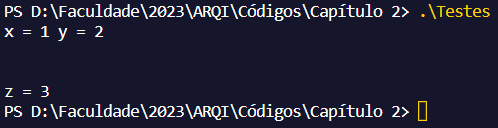
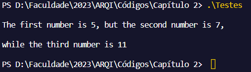

# Dupla:
- Francisco Edinaldo dos Santos Silva   -    472729
- José Tiago Torres de Lima - 511943

#  Resolução de exercícios - 2.7 

##  Questão 1 
A) CORRETA.  
B) INCORRETA, para a quebra de linha nesse caso, o certo seria colocar "0AH" onde se deseja quebrar a linha em vez de colocar "\n".  
C) INCORRETA, quando se coloca "ADDR number" nessse caso, não será impresso o conteúdo da posição de memória, mas sim o endereço de memória da variável, o certo seria excluir o "ADDR", dessa forma seria impresso de forma correta.  
D) CORRETA.  
E) INCORRETA, a linguagem não reconhece o "\n" como quebra de linha, para isso deveria usar "0AH" em vez de "\n".  

## Questão 2
Sabemos que a diretiva INVOKE destrói o conteúdo do registrador EAX, neste caso, quando chamamos essa diretiva para usar o printf, estamos destruindo o conteúdo de EAX que será utilizado logo em seguida. Desta forma, o que podemos fazer - como segue o exemplo abaixo - é empilhar o registrador EAX antes de chamar INVOKE e desempilhar EAX logo após, sendo assim, não perdemos o valor de EAX que seria utilizado logo em seguida. 
```asm
    mov num1, 5
    mov EAX, num1
    push EAX
    INVOKE printf, ADDR msg1fmt, ADDR msg1, num2
    pop EAX
    mov num2, EAX
```

### OBS: As questões 3 e 4 não seguem exatamente o que é solicitado no livro, sendo inserido apenas as imagens do que é impresso na execução do programa, à pedido do professor durante a aula. 

## Questão 3

 

## Questão 4

 

## Questão 5
*Resposta em código nos arquivos "questao5.asm" e "questao5.c".*

## Questão 6
*Resposta em código nos arquivos "questao6.asm" e "questao6.c".*

## Questão 7
*Resposta em código nos arquivos "questao7.asm" e "questao7.c".*

## Questão 8
*Resposta em código nos arquivos "questao8.asm" e "questao8.c".*
